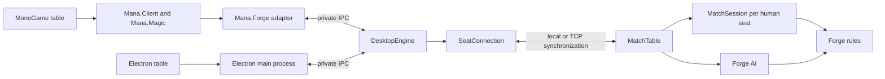

# Mana Table architecture

Mana Table has a Java rules adapter (`forge-api`), an Electron reference client
(`forge-desktop`), and a MonoGame client (`mana-native`). Forge remains the installed
rules engine. Switching a seat between local and remote must not change game logic,
decisions, visibility, or presentation.

## Shared match and synchronization

`MatchTable` owns one Forge game and one `MatchSession` per human controller.
Solo and network matches use that same session, including activity, commander
damage, legal combat choices and private information filtering. Forge's AI remains
inside the authoritative game. The old `NetworkMatchSession` and its separate
network GUI projection have been removed.

`SeatConnection` carries observe/reply/concede operations through `SyncTransport`.
Solo uses a local connection. A lobby can mix local and TCP connections; all receive
complete seat-filtered snapshots from the authority. Networking contains no card,
combat or decision interpretation. `SyncLobby` manages deck selection, readiness
and seat ownership. `PortForwarding` is an independent reachability service.

Sync protocol 3 negotiates its version before joining. Ordered sequence numbers
and cached command receipts prevent replay after a lost response. A resume token
restores the existing seat, followed by a complete snapshot; leaving revokes the
token. Resume covers an interrupted connection while the host process remains
alive, not saved games or host migration. All friends need the same protocol build.

The IPC ready message publishes protocol version and capabilities. `Mana.Forge`
checks both. Snapshots retain publication and board revisions; prompt handles
remain scoped capabilities, separate from opaque card presentation identities.

## Native client boundaries

| Project | Responsibility |
| --- | --- |
| `Mana.Contracts` | Catalog, setup and match-connection interfaces; typed Commander snapshots and commands; visibility enumeration and art-source contract |
| `Mana.Client` | Generic versioned replica, command scheduling, stale-poll protection, main-thread completion delivery and local artist asset loading |
| `Mana.Magic` | Phase language, legal-target interpretation, click/drag command construction, Auto priority, Magic card classification and Magic art provider |
| `Mana.Forge` | Process lifetime, protocol negotiation and Forge-to-contract mapping |
| `Mana.Renderer` | Canvas, projection, immutable table layout, card poses, hit geometry, motion and effects |
| `Mana.Table` | Application composition, controls, overlays and rendering of the shared session |
| `Mana.Conformance` | Test-only semantic scenarios, canonical full checkpoints and first-divergence reporting for two engine adapters |
| `Mana.Client.Tests`, `Mana.Table.Tests` | Headless behavior checks and separate native test/automation executable |

`TableScene` describes visible ranks, command cards, piles and hand placement.
Painting and input use the same displayed pose. Card names never identify an
occurrence. Client inspection, effects and interactions enumerate the same allowed
views, so revoked information is removed consistently. Artist image loading is
separate from GPU texture creation; the default Magic provider is replaceable.

The native setup's **Deck builder** opens after file or clipboard import and is
available for saved decks and new drafts. Its library, deck list and large face
preview share one workspace. `IEngineCatalog` exposes paged name/rules/type search,
color-identity and mana-value filters, deck CRUD, undo/redo, text export, and
authoritative commander candidates/partner compatibility. Search is debounced
and runs independently of deck edits; generation checks discard stale results.
The contract preserves exact printing IDs, alternate faces, mana values and
color identities. The view provides quantity edits, Main/Sideboard moves, deck
filtering, commander roles, nonland mana curves, validation review and save retry.

`TableGame.Decks` routes every mutation through the same readiness, persistence
and refresh path. Each native edit carries both the deck ID and revision; the
adapter rejects commands for a different active document or an older revision.
Opening the builder refreshes its document after match setup has reopened it.
Forge's `DeckCommanders` moves existing occurrences between Main, Sideboard and
Commander in one `DeckEditor` batch; replacing a commander returns the old card
to Main. Duplicating creates a separate persisted deck with identical printings.
The same saved list feeds solo and network setup. Validation remains authoritative
in Forge, and invalid or unsaved decks cannot enter setup.

`TableGame.LobbyFlow` separates selecting, confirming, readying and starting.
The deck chooser and the builder return to a shared review of commander faces,
counts, validation and save status. Confirm prepares the solo setup or submits
the saved deck through `SelectDeckAsync`; multiplayer readiness is a separate
explicit operation. A confirmation belongs to the selected saved document and
current setup mode. Opening a different deck, any edit, entering the builder,
switching modes, or leaving a table invalidates it. Selection and builder entry
await the ordinary `SetReadyAsync(false)` before opening or changing a document.
Browsing the chooser alone preserves readiness. These are client workflow states;
rules and the synchronized seat roster remain authoritative in the existing engine.

`TableGame.LobbyView` renders the four-seat roster, commander preview, saved/precon
chooser, review, native invite entry, and connection details. Its hit scopes include
the active modal, selected deck, confirmation, mode, readiness and start permission.
Modal input cannot reach controls behind it. Start requires current confirmation
plus the engine's readiness/start state. Builder edits preserve the selected AI
opponent IDs when the updated deck is reconfirmed. Returning from a network game
refreshes the lobby before showing its controls; readiness must be declared again.

`TableGame.LobbyDecks` shares the searchable chooser between saved/precon lists
and engine-owned AI opponent choices. Its read-only deck review browses the loaded
document by section, name, type and rules text, with exact-printing previews.
Browsing or reselecting the current deck makes no engine mutation and preserves
readiness. Entering the builder from a reviewed card first withdraws readiness,
refreshes the editor revision, and selects that printing in its original section.
`TableGame.DeckPresentation` shares the main-deck curve and alternate-face rendering
between building and review. Search and page state participate in hit scoping.

Table social features use the optional `ITableSocial` contract independently of
`IMatchConnection`. `sync.TableConversation` owns a bounded 200-entry transcript,
stable participant IDs, display names and a monotonic social revision. The same
`SyncTransport` dispatch supplies the authoritative sender seat for local and TCP
connections; a client cannot nominate a different sender. Every social command
is scoped to its table ID, and ordered transport receipts prevent duplicate sends.
Names, text, message kinds, fixed emotes and rate limits are checked at the host.
Ready/deck/join/leave/start/return events share that transcript without changing
rules or game decisions. Names enter the existing RegisteredPlayer setup.

`ConversationReplica` rejects old/table-mismatched snapshots and calculates
unread state and local mutes using participant identity rather than reusable seat
numbers. Social polls and sends use their own asynchronous state, never the
game-command epoch or Busy flag. The native drawer uses a separate input scope,
consumes its own pointer area, and isolates text entry from gameplay shortcuts.
The rest of the table remains interactive. Full messages can be expanded, and
older pages retain an anchor while new messages arrive. Chat exists only while
connected to a human table; solo AI does not simulate human conversation.

Native hand, battlefield, stack and visible pile cards grow to 410x574 after a
180 ms hover. The original scene occurrence animates upright and is painted once
above its rank, then settles back on pointer exit. Its displayed pose supplies
its hit region; original hand slots remain available for browsing the fan.
The local portrait and life total sit at the center above the hand, using the
same seat anchor as incoming combat lines, commander entrances and life effects.
The fan sits behind the portrait, with local battlefield ranks shifted forward
to leave room. Enlarged faces and state panels keep the local target area clear;
the portrait is painted after the hand so travelling cards cannot obscure it.
Revealed and selectable gallery faces use this same pose, focus and deferred
painting path. Anonymous faces have presentation identities scoped to the
decision and original item slot; names never identify an occurrence. Read-only
faces participate in hover hit testing without gaining a selection action.
The gallery makes space for the growing face and keeps its label strip available
for browsing adjacent cards. Paging, search and Continue/Confirm stay below the
enlarged face. Changing the
decision, page or granted visibility removes the old readable occurrence.
Hover focus uses an amber rim, soft edge glow, dark separation and ivory corner
marks. It appears before enlargement and follows the card's displayed pose.
Engine-authorized actions use a persistent 7-pixel ice-blue rim with a pale inner
edge, dark separation and a broad glow, visible before hovering. Only its glow
gently varies during priority; reduced motion keeps it steady. Hover focus and
combat cues retain their separate meaning.
Combat connections and pointer aiming share a straight, filled arrow in the
renderer: a tapered shaft, broad directional head and dark separation from card
art. Attacks are red and blocks blue. Endpoints use the displayed card edges or
portrait rim; short connections scale the head down, and aiming inside the source
card hides the arrow. The renderer contains no combat legality or input logic.
Battlefield counters are separate labeled stacks with an explicit count. Two
types fit on a resting card, with an overflow count; enlargement shows named
counters and current state beside the face, and the inspector paginates the
complete details. Power/toughness always comes from the engine and is never
recomputed by adding the displayed counters.
Current combat keywords drive distinct markers for flying, reach, trample,
first/double strike, deathtouch, lifelink, menace, vigilance and indestructible.
Summoning sickness has an hourglass marker. Flying raises the same card pose
used for hit testing and combat arrows, with separated shadow and air trails;
reduced motion keeps its height while stopping idle movement. Losing an ability
or removing counters updates the existing occurrence, without interpreting
printed rules text or retaining markers after the projection revokes them.
Reduced motion uses the same poses without tweening. Hand plays and casts from Command/zone browsers
require a double-click on the same scoped card within 500 ms, or a legal hand
drag. Other clicks, a drag, Escape, or a changed decision clear the first click.
Required selections and battlefield abilities retain single-click behavior.
Card choices may include an optional `cardId` linking a currently visible
battlefield, command-zone or own-hand occurrence. `TableChoices` validates those
links against the current snapshot. When every choice is on the table, clicking
the original cards stages their engine indices, marks them selected, and uses
the normal action button (or Space) to confirm. Ordered choices use click order;
minimum/maximum counts still come from the engine. Gallery faces remain anonymous,
and library searches, private reveals and non-card choices retain their chooser.

Auto uses `Mana.Client.DecisionAdvance` through the same seat connection locally
and over TCP. It drains engine-authorized empty priority windows, publishing only
the next actionable decision, visible checkpoint, or bounded wait (350 ms / 32
passes). Engine rules and every command receipt still run in order. Duplicate
prompts are not resubmitted; stale revisions and retired-session results are rejected.
Hold, Full control, changed stops, typing, inspection and pointer gestures cancel
further passes; an already submitted command is reconciled. Required decisions,
including blocks, payment and cleanup, are never consumed by Auto.

`PresentationPacing` pauses for visible events, not empty phase changes. Board
changes get 1.1 seconds, ordinary stack changes 1.25, targeted spells or retargets
2.5, resolution 2.6, combat/damage 1.6, and turn changes 1.2. Repeated polls and
new decision handles do not extend a beat. Real choices remain immediately
available during animation. The dock has one stable following state for automatic
empty windows and waits; Auto, Hold and phase stops use a match-scoped input
identity so prompt churn cannot cancel those clicks.

`CardActions` labels engine-authorized battlefield actions as Activate, with hover
guidance and an inspector button. It never infers playability from rules text.
Stack projections include viewer-safe card/player targets (including subabilities).
The renderer draws direct target arrows, marks the exact occurrence and shows a
spell/ability callout. `MatchActivity` retains public resolution descriptions and
spell rules, plus token arrival names; `ActionFeedback` exposes a timed summary
and reviewable details. Recent changes are reported without inferring causality.
New public battlefield occurrences receive arrival cues. Departures to public
graveyard/exile retain a brief ghost at the former position; hidden transitions
immediately revoke it. No extra game rules or multiplayer-specific path is added.
`TextureFiltering` builds GPU mipmaps once per loaded image; anisotropic card
sampling handles angled minification, and table surfaces request 4x MSAA.
Full-resolution artwork and rendered rules text remain available for inspection.

`TablePresence` turns public hand/library counts and life changes into seat cues.
Opponent draw cues contain no card identities; the local hand animates only its
authorized visible cards. `SceneMotion.Hold` keeps direct manipulation attached
to the pointer, then continues from the held pose when a new snapshot arrives.
Spells rise into the central response area before settling onto the battlefield.
These effects never submit input, postpone snapshots, or hold game priority.
Reduced motion skips travel, entrance delays, anonymous draws and impact rings.

`ICardEngine` composes narrower catalog, setup and match connection interfaces.
This supports selecting another backend without adding a renderer or multiplayer
implementation. It does not imply live engine migration. A native rules engine is
not installed yet. The conformance runner requires canonical occurrence aliases,
controlled random outcomes and complete rules/seat checkpoints from each adapter;
the current Forge transport benchmark proves synchronization, not cross-engine
rules equivalence. A complete Forge rules-state oracle remains separate work from
the existing test-only seat-view audit.

## Where to change things

| Area | Entry points | Responsibility |
| --- | --- | --- |
| Desktop process | `forge-desktop/main.cjs`, `preload.cjs` | Window, permitted IPC, file dialogs, artwork cache, engine lifetime |
| Runtime/transport | `runtime.cjs`, `engine-client.cjs` | Java/path resolution, request IDs, replies, startup status, logs |
| Workshop | `renderer/app.js`, `presets.js` | Catalog, deck editing, imports, practice, preset browsing |
| Match coordination | `renderer/match.js` | Setup, scoped answers, polling, stable board rendering, prompt controls |
| Card interaction | `hand-view.js`, `table-gestures.js`, `card-preview.js`, `table-card-preview.js`, `battlefield-view.js` | Fan layout, cancelable dragging, card enlargement, optional inspector, alternate faces and crowded ranks |
| 3D presentation | `table-scene.js`, `table-scene-world.mjs`, `table-world-layout.mjs`, `table-scene.css` | World-space seating and camera, projected controls, stable card objects, textures, movement and graphics fallback |
| Match explanation | `turn-guide.js`, `match-feedback.js` | Phase guidance, activity history, turn indicators and animation |
| Table events | `cast-view.js`, `reveal-view.js` | Pending spell and stack portraits, prompt-scoped revealed cards |
| Response preferences | `preferences.cjs`, `play-preferences.js`, `response-skip.js` | Remembered Auto/Full control, own-turn stops, temporary holds and engine-authorized passes |
| Combat | `combat-view.js` | Attackers, defenders, legal block connections and assignment controls |
| Battlefield combat | `table-combat.js` | Creature-first click pairs and scoped drags, legal destination highlights, defender badges and connection arrows; detailed combat is optional |
| Java protocol | `DesktopEngine.java` | Method dispatch, current deck, saved files, practice and one active match |
| Deck hooks | `CardCatalog`, `DeckEditor`, `DeckImport`, `DeckPresets`, `MatchSetup` | Search, revisioned edits, validation, imports, detached match decks |
| Game adapter | `MatchSession`, `MatchActivity`, `HeadlessPlatform`, `CombatCardIds` | Human input, AI session, visibility filtering, stable projected state |
| Minimal observation hooks | `GameStateMapper`, `GameObservation` | Smaller immutable projection and event invalidation for other consumers |

Deck-building discovery and review live in `deck-workshop.js` / `.css`, with
`DeckInsights.java` providing role estimates and recommendations. The script
loads before `app.js`; its callbacks use the shared app state after initialization.
`app.js` owns the edit queue. Catalog controls count by card name across printings
and reuse an existing printing in the selected destination. Deck-row quantity
and section moves preserve exact printing IDs. Moves use a single atomic edit
batch, so undo restores both sections. Queued edits capture the deck ID and source
section; review replies are checked against the deck ID, revision, and format
request key. Search/grouping filters change presentation only.

Java classes above live in `forge-api/src/main/java/forge/api`. Renderer files
are under `forge-desktop/renderer`. The API README is the detailed
[integration contract](../../forge-api/README.md).

Most renderer files use classic scripts and shared globals, loaded in the
order listed by `renderer/index.html`. The 3D controller lazily imports a native
ES module and the pinned Three.js build. There is no bundler or UI framework.
CSS is layered: base workshop/match styles, battlefield layout, then
feature-specific styles. Keep feature behavior in its owning file and document
cross-file assumptions instead of expanding the central `match.js` indefinitely.

Battlefield cards use an explicit `battlefield` presentation in `cardTile`.
The 2D fallback in `battlefield.css` reserves a square footprint around each portrait surface, which
turns a full 90 degrees when tapped. Current stats, counters and damage remain
upright. `match-feedback.js` animates that same surface only when the tap state
changes. Two battlefield ranks remain vertical at every supported size.
`battlefield-view.js` overlaps crowded ranks and provides edge buttons, wheel and
keyboard browsing; native scrollbars are hidden without removing access to cards.
`card-preview.js` delegates match roots to `table-card-preview.js`. Hand cards lift
in place; other cards use an image-only, pointer-transparent layer anchored to the
source. The optional rail inspector shows rules and current values. Both consume
only the visibility-filtered projection, including permitted alternate faces.
`hand-view.css` reserves the lower-left player controls; `hand-view.js` keeps the
fan and local gap behavior. `match-feedback.css` fixes response controls at the
lower right with fixed grid tracks, including the persistent turn/step dock.
The primary action stays at the bottom of the prompt; explanatory text stays
inside its scrollport. The prompt's instructions and each upper information panel scroll
independently; decision buttons remain outside the prompt scrollport. Preferences
open above the fixed controls. Card inspection occupies the upper information area.
Game overlays sit above the hand and player controls while selecting combat or
library cards. `cast-view.js` reconciles projected sources and stack IDs without
replaying entrance animations on polls; its portraits do not intercept targets.
`reveal-view.js` pages through only the current reveal's cards and clears them
when that prompt ends. Both views respect hidden identities and reduced motion.

## A game action, end to end

1. The engine publishes a stable, immutable snapshot for the trusted human viewer.
2. The renderer displays the current prompt and gives actionable cards that
   prompt's handles. It retains DOM nodes across status-only updates and reuses
   unchanged hand cards when other zones or player information change.
3. A click/drag records its source element, session, and prompt before submitting.
4. The host validates those IDs and the answer, then dispatches to the existing
   human controller. Synchronous dialogs complete a response future directly.
5. The engine resolves the action. The renderer acknowledges immediately and
   polls for the next stable state; animation never delays or submits input.

`match.js` prevents overlapping polls and ignores results from superseded
sessions. Polling is faster while resolving than while waiting for input.
Required selections keep the engine's message and enabled actions; explanatory
turn guidance never chooses an action on the player's behalf.

In **Auto**, `response-skip.js` submits `passIfNoResponse` only for
`InputPassPriority` with engine-issued `canAutoPass: true`.
This permission comes from the controller's current action scan. Main phases
advance when no playable action remains; land plays, affordable spells and
abilities, and castable commanders hold priority. Required inputs always wait.
The normal session/prompt checks
still apply. Switching to **Full control**, selecting an own-turn stop, or using
**Hold this turn** cancels a queued pass. Only the temporary hold resets at a
turn/session boundary. Both main phases can be selected as saved stops. A
one-second pause before leaving an empty main phase lets the last play settle
on the table. Browsing the workshop suspends automatic passes.
`preferences.cjs` validates and atomically stores the response mode, phase stops
and inspector preference in the fixed profile file `preferences.json` through
dedicated, origin-checked IPC. Auto is the production default; the renderer uses
Full control until loading finishes. Failed saves preserve the latest local
choice instead of re-enabling automatic play. Tests seed Full control unless
they explicitly exercise Auto. Packaging preserves this file across betas.

## Identifiers with different jobs

| Value | Use | Lifetime |
| --- | --- | --- |
| Catalog printing `id` | Deck entries and printing lookup | Supplied catalog; opaque and case sensitive |
| Deck `revision` | Reject stale edits and setup previews | Current deck editor; monotonically increases |
| Match `id` / action `sessionId` | Bind an answer to the active game | One session |
| Prompt `id` / action `promptId` | Bind an answer to the pending decision | One prompt |
| Card `key` | Select an engine-authorized card for that decision | One prompt; never reuse it |
| Card `visualId` | Correlate visible cards for presentation | Session visibility; not an action capability |
| Card `combatId` | Correlate combat positions, including redacted face-down cards | Visible combat position; not a rules identity |
| `revision` / `boardRevision` | Refresh status versus the last stable board | One session |
| Activity event `id` | Deduplicate displayed history | One session; not a replay or save cursor |

Hidden zones publish counts, not identities or ordered placeholders. Library
searches expose only the engine's temporary selection/reveal set. Face-down
objects and alternate faces must follow the adapter's visibility rules. Do not
serialize live Forge objects, raw logs, or mutable views directly to the renderer.

## Extending the app

**New visual component:** add its script/styles to `renderer/index.html` and the
static resource allowlist in `main.cjs`. Reuse projected state and the existing
answer path. Check keyboard operation, minimum window size, and reduced motion.

**New engine command:** add dispatch/validation in `DesktopEngine`, allowlist it
in `main.cjs`, document it in the API contract, and exercise it through the real
pipe transport. `preload.cjs` intentionally exposes a small bridge, not Node APIs.

**New match state:** copy data at stable engine/controller boundaries inside
`MatchSession`; do not read live views from the transport or renderer threads.
Check both authorized visibility and absence of hidden details.

**New host module:** update the explicit file list in `scripts/package.cjs` and
verify a packaged smoke test. A source-tree run alone will not detect a missing
file in the package.

## Upstream boundary and current limits

Card scripts live in `forge-gui/res`; core rules and AI stay in their existing
modules. The adapter reuses the shared human controller without starting Swing
or LibGDX. Existing integration touchpoints include event unsubscription,
explicit resource/profile paths, and reusing initialized `StaticData` through
`FModel.getMagicDb`. `IGuiGame.chooseColor` retains the source card in API color
prompts while its default delegates to the existing picker for other clients.
Keep further shared changes small and reviewable.

## 3D scene and interaction boundary

The default table has authored world coordinates for two through six seats.
`table-world-layout.mjs` arranges playmats, life medallions, hidden hand backs,
decks, public discard piles, commanders, and battlefield ranks around the table.
The camera fits the whole table to the viewport; clicking a player's name moves
closer to that seat, and **Whole table** restores the overview. Camera focus never
sends an engine action. Crowded ranks page in world space using their arrows,
the wheel, or Left/Right/Home/End on a focused card.

Hand, battlefield, and casting portraits are meshes with card thickness and soft
projected shadows. `visualId` correlates the same object across zones; a source
still on the battlefield gets a separate representation for its stack ability.
Polling updates targets without replaying entrances. Transforms interpolate
only until settled, then rendering sleeps. Reduced motion and Animations off
snap directly to the new state. DOM flight clones are disabled for scene cards.

World objects project their bounds back onto accessible DOM controls each frame.
The 3D view removes the old scrolling seat lanes; the 2D fallback keeps them.
Held and casting cards use camera-relative screen anchors and face the camera.
Their depths are camera-relative too: resting cards follow fan order, and a
lifted or dragged card sits closer than its neighbors. Ground-plane intersections
must not determine held-card depth; the camera tilt otherwise lets lower cards
occlude the enlarged face. Hand badges behind the lifted card are hidden alongside
covered world labels, because the accessible DOM sits above the WebGL canvas.
Clicks, keyboard input, legal target highlighting, combat arrows, and scoped
drags continue through the existing engine answer path. A combat click selects
your creature locally, then submits one scoped assignment on a legal destination click. Polls
retain that selection only within the same prompt. Escape, a new prompt, and
mode changes clear it. The engine supplies all attack and block eligibility.
Combat arrows follow the projected targets as the camera moves.
The battlefield combat dock provides instructions, assignment counts, undo and
confirmation. Attacking and blocking meshes advance within their playmats;
projected hit regions follow them. Opponent life markers show incoming attacks.

Network sessions receive `CombatInputState` from the host's active `InputAttack`
or `InputBlock`, scoped to the input owner and sequence. Only that snapshot
authorizes legal pairs; highlights do not. `assignAttack` and `assignBlock` send
one controller operation containing both endpoints. The host rechecks the input
sequence and legality before changing combat. Assignment updates refresh the
prompt ID; unchanged polls preserve it. Combat events flush immediately so
observers see assignments while the acting player reviews them.

Life numbers, stats, menus, the detailed
combat inspector and reveal/search galleries remain HTML controls. Projection
writes and combat SVG updates are excluded from the scene's mutation observer
so they cannot keep the render loop awake.
World labels covered by held or casting cards become transparent while retaining
their hit regions, preventing DOM text from showing through a WebGL card face.

Card textures come only from existing authorized card portraits. Opponent hand
counts produce anonymous backs, without reading hidden card identities. Face changes clear
the previous texture; objects leaving the visible projection are removed and
disposed immediately. No hidden-zone images are synthesized. Context loss or
initialization failure restores the complete 2D presentation, and the player
can switch with **3D table / 2D table** without changing the engine state.

Three.js is pinned in `package-lock.json` and served through two exact protocol
paths. Packaging copies its two runtime modules and MIT license into the ASAR;
the scene never downloads executable code. `table-scene.spec.cjs` checks real
engine card continuity, tapping, idle rendering, sizes, context loss and retry.
`table-world.spec.cjs` checks two, four, and six seats, projected life hit targets,
camera focus, and crowded-rank paging while a real engine decision stays unchanged.
`battlefield-fit.spec.cjs` and `multiplayer.spec.cjs` retain explicit 2D fallback
coverage for scrollports, seat navigation, and drawers.

This is a local, single-human application with one active match. There is no
network API, multiplayer service, durable match resume, or full tournament-format
legality service. The engine's own GUI modules and network features are separate
from Mana Table's UI. Packaging is currently Windows x64 only.
